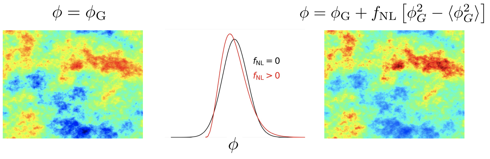
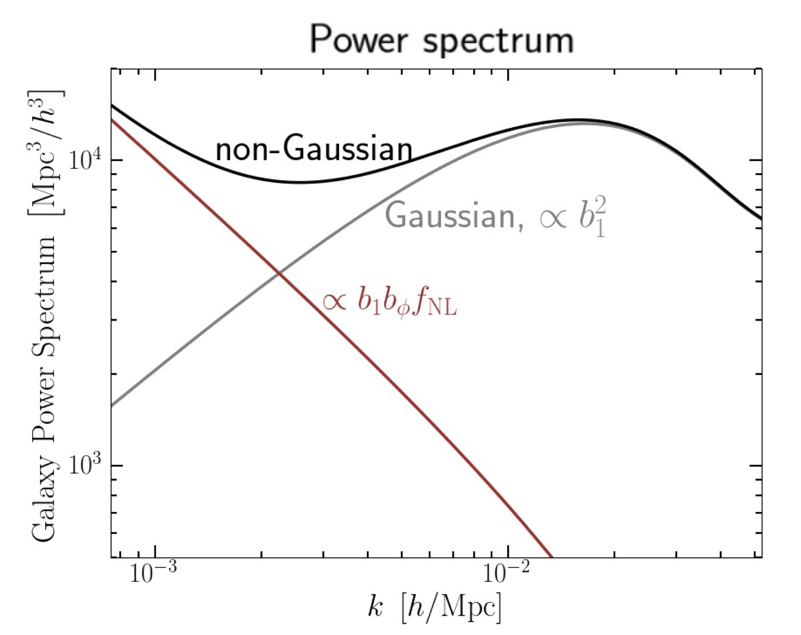

# Primordial non-Gaussianity (PNG)

## The Origin

## Paramterize 

### local shape

### other shapes

## Obsevation constraints

### power spectrum

Dalal et al. 2008, finds that:
- local PNG leaves distinct scale-dependent signature on the galaxy power spectrum.  
 

**To constraint $f_{\rm NL}$, need to assume sth. about $b_1$, $b_{\phi}$.**

