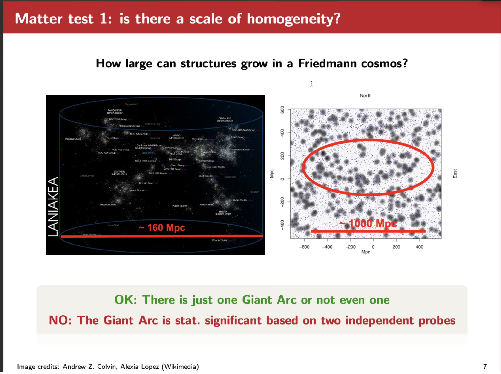

# Can we test cosmic homogeneity and isotropy?

[Dr. Jenny Wagner](https://thegravitygrinch.blogspot.com), 2024-03-19

Galaxy & Cosmology Seminar

https://astro.tsinghua.edu.cn/info/1120/2798.htm

---

## Introduction

1. simple Friedmann equation at 0-rd level.

2. boundary condition 

- [ ] average against GR?

1. **define**  homogeneity and isotropy

clever option 2!

nowadays idea: op3.

## Test of cosmic homogeneity and isotropy

possible tensions between observation and theory?

### Matter test 

- arc distrubution of GRB, galaxy. 

Matter 2: do we have a peculiar velocity?

right fig: degenaracy between the peculiar velocity and hubble flow.

Matter 3: CMB dipole v.s. cosmic matter dipole 

- radio galaxies from NVSS, 2.7 sigma 
- ~million quasars from WISE, 4.4 sigma 
- (wait for 5 sigma)
- possible solution:
  - see the redshift evolution?

### Space-time test

1. uniqueness of Friedmann model parameters 

- Hubble tension 

2. curvature test 

### general comments

fitting problem in cosmology 

## Summary

data-driven era now!