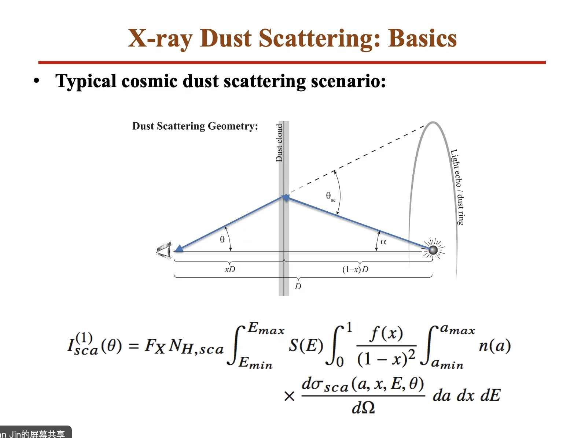
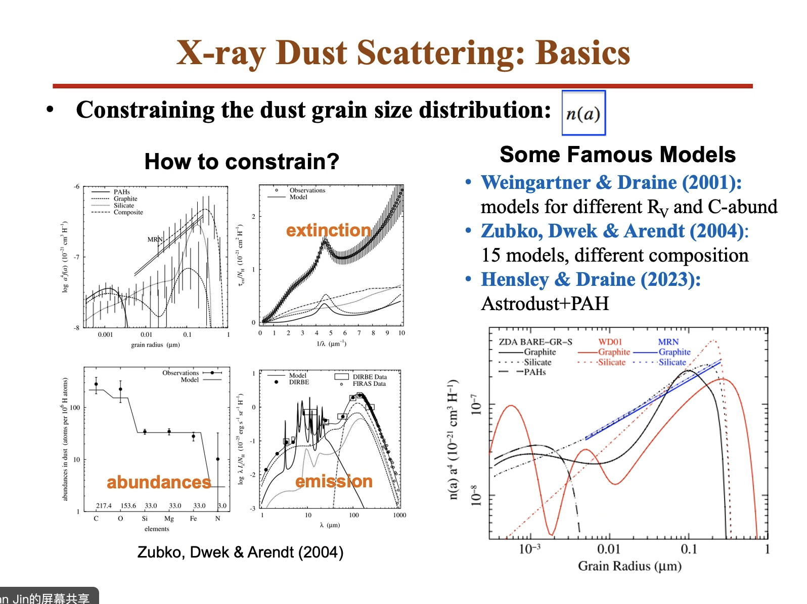
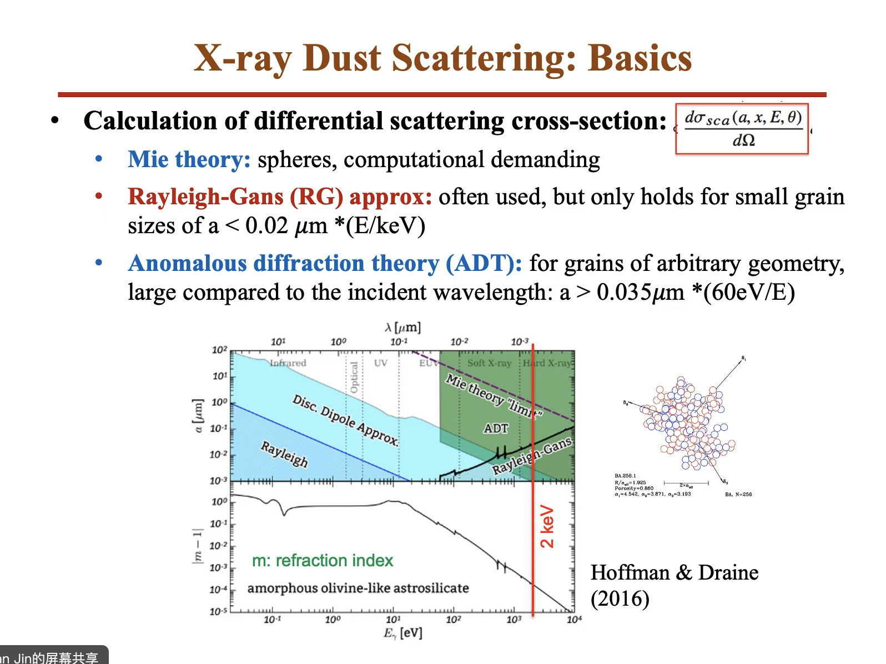
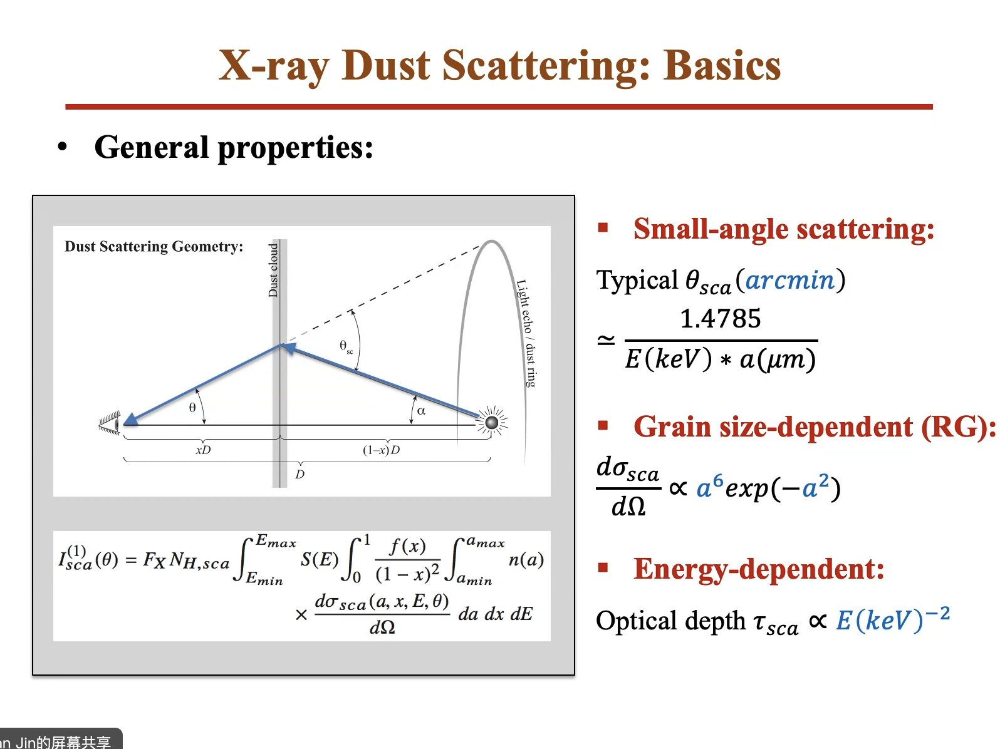
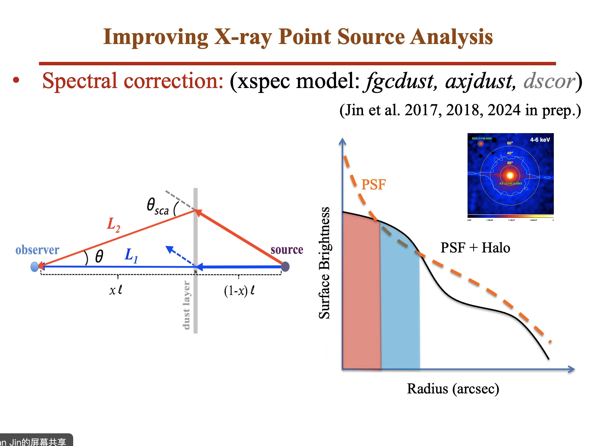
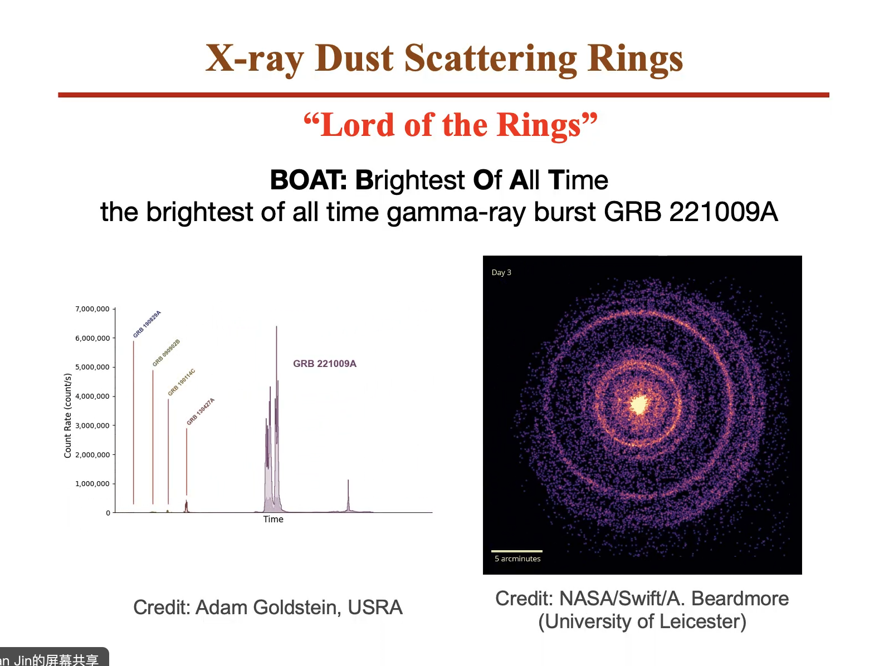
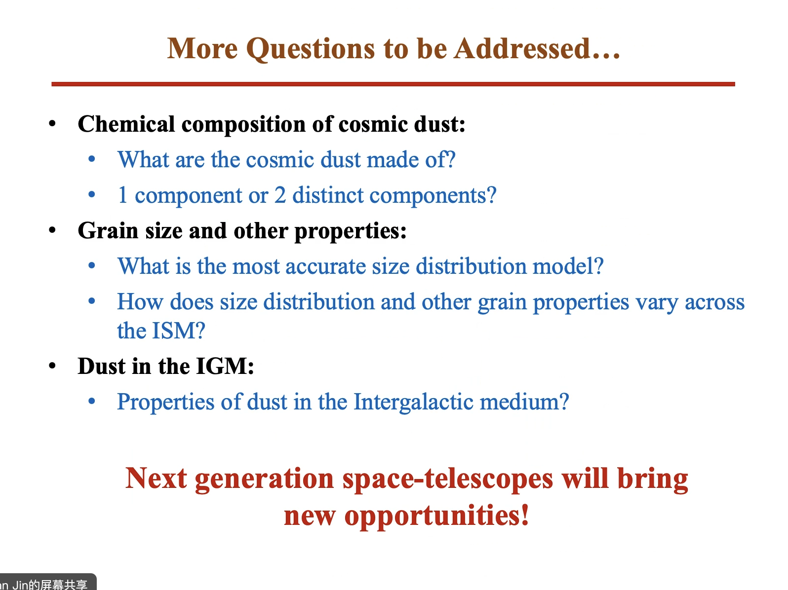
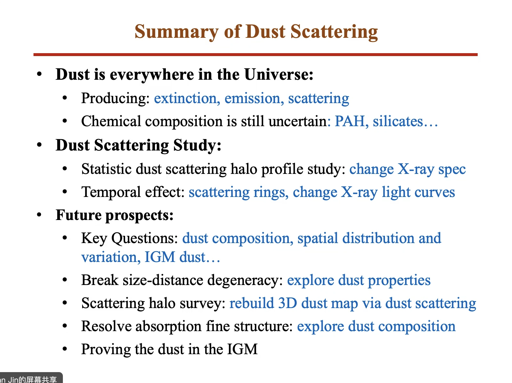
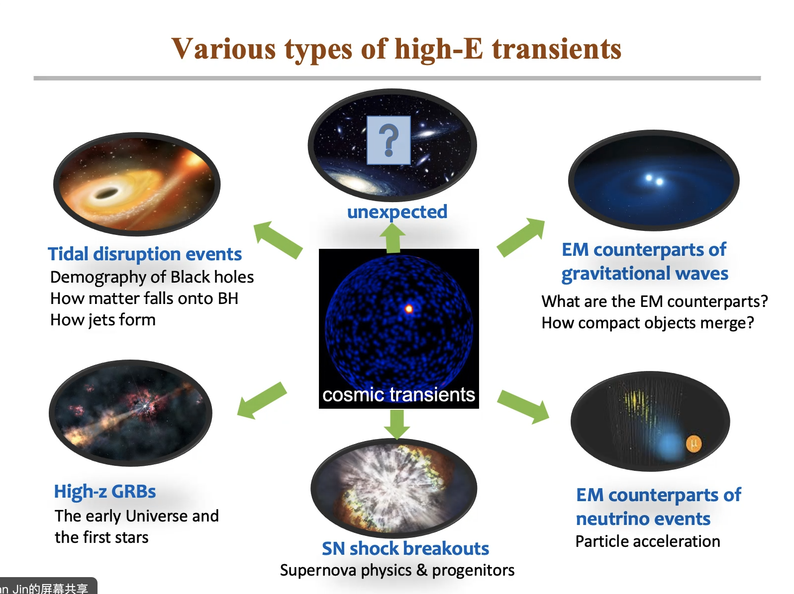

---
prev:
    text: 'test cosmological principle'
    link: '/Lectures/2024/0319CosPri'
next: 
    text: 'Polarization of pulsar wind nebulae'
    link: '/Lectures/2024/0328pulsar'
---

# Interstellar X-ray Dust Scattering: Current Research and Future Prospects

金驰川（NAOC）, 2024-03-21

Colloquium

https://astro.tsinghua.edu.cn/info/1100/2779.htm

--- 

## Introduction

dust in MW -> dust in anywhere of Universe 

## Properties of Interstellar Dust 

- sub-micron size 
  - see grain size distribution for different species at Hensley & Draines 2018(?)
- Elemental building blocks
  - Si, Fe, 50% C, 30% O  locked ...
- effects: extinction, scattering, polarization
  - astrophysics:
    - dust plays a crucial role through the lifecycle of ISM
    - AGN torus 

## X-ray Dust Scattering

- X-ray Dust Extinction 

- the scenario: 

- grain size distrubution $n(a)$
  
- cross-section $\frac{d \sigma}{d \Omega}$ 
  

### scattering effects

#### halo

- radial profile 
- halo shape as function of grain size and dust distance 
  - these 2 parameter degenarate. 

- application: 
  
  depend on energy, should be calibrated in each energy band. 

- time-lag of the scattering 

#### ring

use to fit dust distribution. 

## Future Prospects of X-ray Dust Scattering

1. break degeneracy between grain size and distance
2. build 3D dust map via scattering
3. resolve the X-ray absorption fine structure (XAFS) of dust grains.
4. detect the scattering by the IGM dust.

## Summary of dust scattering

## Einstein Probe Mission

https://ep.bao.ac.cn/ep/
