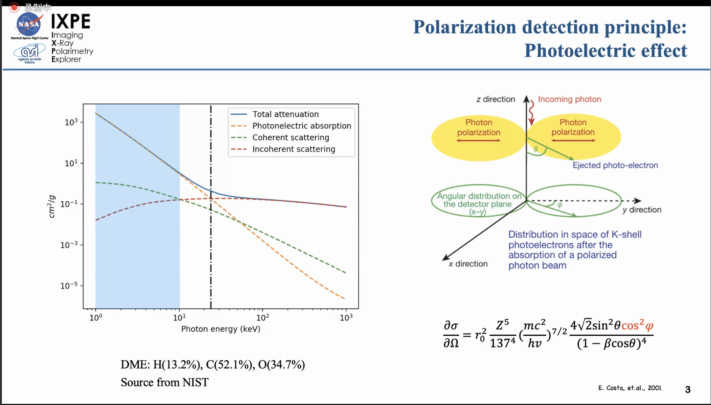
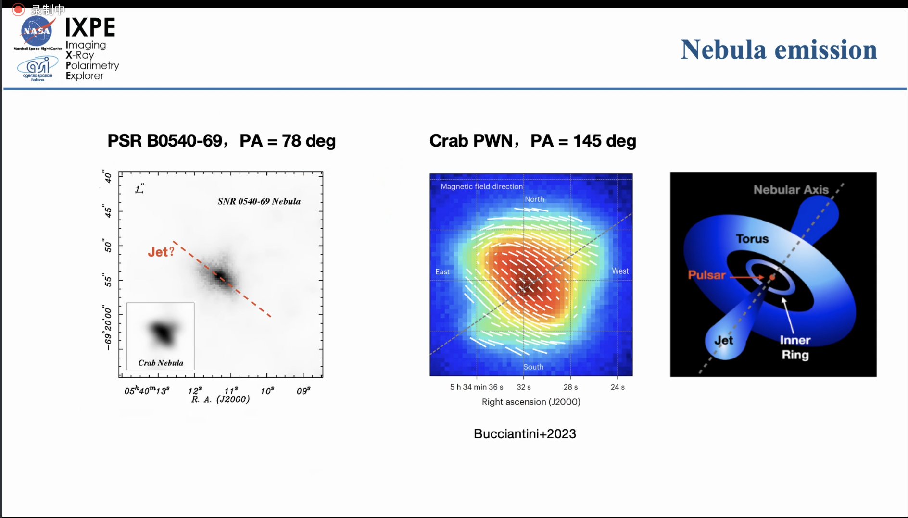

---
prev:
    text: 'Xray dust scattering'
    link: '/Lectures/2024/0321XrayDustScat'
next: 
    text: 'Galaxy Evolutionary Mechanisms'
    link: '/Lectures/202404/24GalEvo'
---

# A polarized view of the Pulsar Wind Nebulae with IXPE 

谢斐（Guangxi University）, 2024-03-28

Colloquium

https://astro.tsinghua.edu.cn/info/1100/2780.htm

--- 

## IXPE

- Imaging X-ray Polarimetry Explorer (IXPE)
  - for known bright X-ray sources
  - extended source: FoV 12.9 arcmin

- photoelectric effect

### method

- get a track of the photon
- find the head of the track 
  - the low density side is head, since energy loss increase with decreasing kinetic energy.
- measure polarization direction
- statistical analysis of all photons

### meaning 

IXPE: polarization x image at X-ray band

## pulsar wind nebulae

hot bubbles of relativistic particles and magnetic fields emitting non-thermal radiation.

Interesting objects:
- M1
- Vela Nebula
  - 2 arcs
  - 290 pc
- MSH 15-52

Main findings: 
- for Vela, the X-ray and radio polarizaiton are consistent with each other.
- for MSH 15-52, B polarization follows the structure of the nebulae.
- for "crab twin": structure fit from mophology or polarization?
