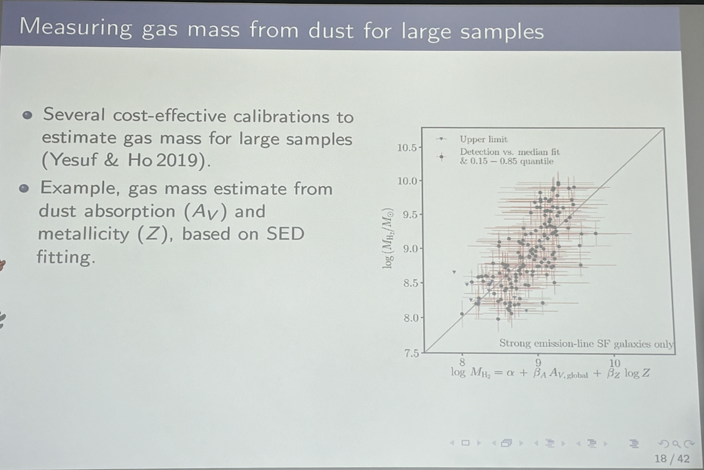
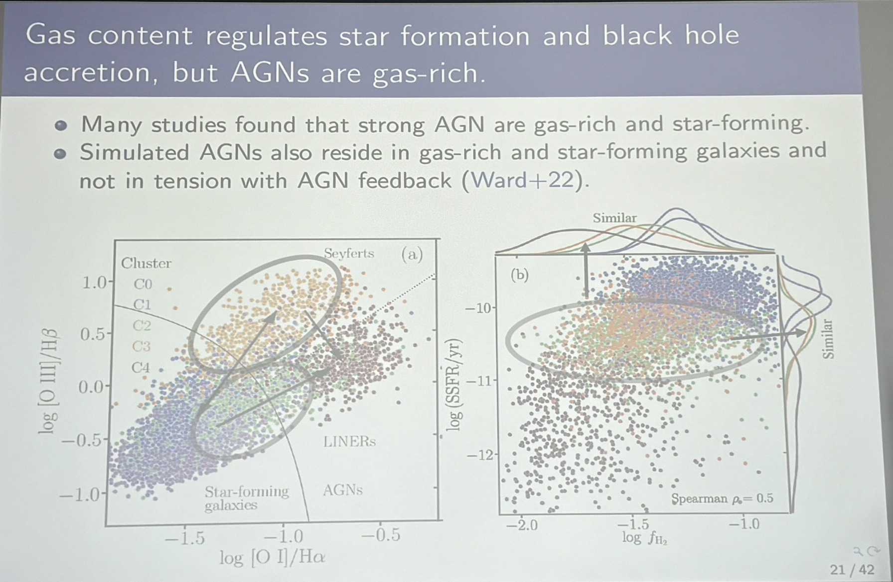
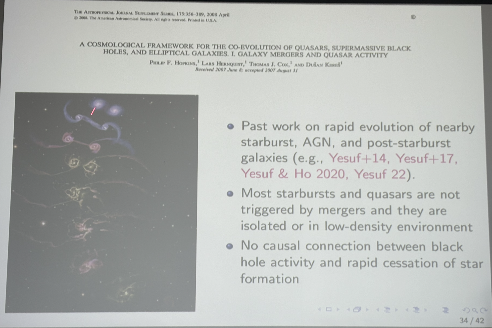

---
prev:
    text: 'Pulsar Wind Nebulae with IXPE'
    link: '/Lectures/2024/0328pulsar'
next: false
---

# Evolutionary Mechanisms in nearby galaxies: Insights from Statistical Analysis of Observations and Cosmological Simulations

Hassen Yesuf (SHAO), 2024-4-24

Informal talk

https://astro.tsinghua.edu.cn/info/1101/2816.htm

--- 

- energy & momentum input from active black holes & supernovae are important for galaxy evolution.
- Star-forming galaxy power spectra -> galaxy properties (SFR, metallicity, dust content, etc.) 
- AGN (active galactic nuclei) spectra -> whether or not 'high-acceration' black hole 
  - related to which side do you observe the AGN. 
- SED fitting 
- measure **gas mass** from **dust**  
- ==find:== most nearby (z<0.35) AGN hosts are NOT gas-poor. 
- many AGN hosts are still in star-forming, not quenched or green valley. 

- 2 components are actually 'same': 

......

- quantify enviroment with galaxy stellar mass rather just number density of galaxies.

....

- how galaxies evolve from star-forming to quench... Yesuf's works:  

- future works:
  - SFH for low mass galaxies:
    - FAST: map the gas around nearby low-mass galaxies, eg. NGC 4713 (17 hrs in 2023) 
    - indirectly study the impact of gas acceration with **metalicity**.
  - CSST 
    - stellar mass asymmetry with image survey
      - minor mergers, etc. 
    - ...
  - uprecedented maps of multiphase gas in multiscale environments in near and sitant Universe with SKA, eROSITA, MUST etc. 

## Summary

- Galaxies are complex systems and are influenced by SMBH feedback, gas accretion, mergers, and multiscale environments
- Despite their many merits, current cosmological simulations do not accurately reproduce regularities observed in nearby galaxies.
- The halo-scale environment and related processes influence the availability of cold gas, thus affect both short-term activity and long-term quiescence in galaxies.
- A combination of recent gas accretion, leading to episodic starbursts and black hole activity, alongside ancient bulge buildup, provides a plausible explanation for the structural, spatial, and temporal variations observed in nearby galaxies.

## Q&A 

大家花了很多时间讨论：为什么大尺度 under dense 的地方 merger rate 反而高。
基本信息有：
- 尺度 cut 是projected的，红移的cut是独立的，但并不影响结果。
- 大尺度 under dense 的地方 merger rate 高，得到了 simulation 和 observation 的一致结果。
- 小尺度 over dense 的地方 merger rate 高，对于simulation来说resolution有困难，observation的结果也不十分可信，因为sample incomplete。
- 至于“大尺度 under dense 的地方 merger rate 反而高”的原因并不很清楚。可能是velocity太大，也可能是在高红移merge过了，可以从数据中研究……

另一个问题是传统上认为非常亮的 AGN 能源来自 merger，现在发现并非如此……